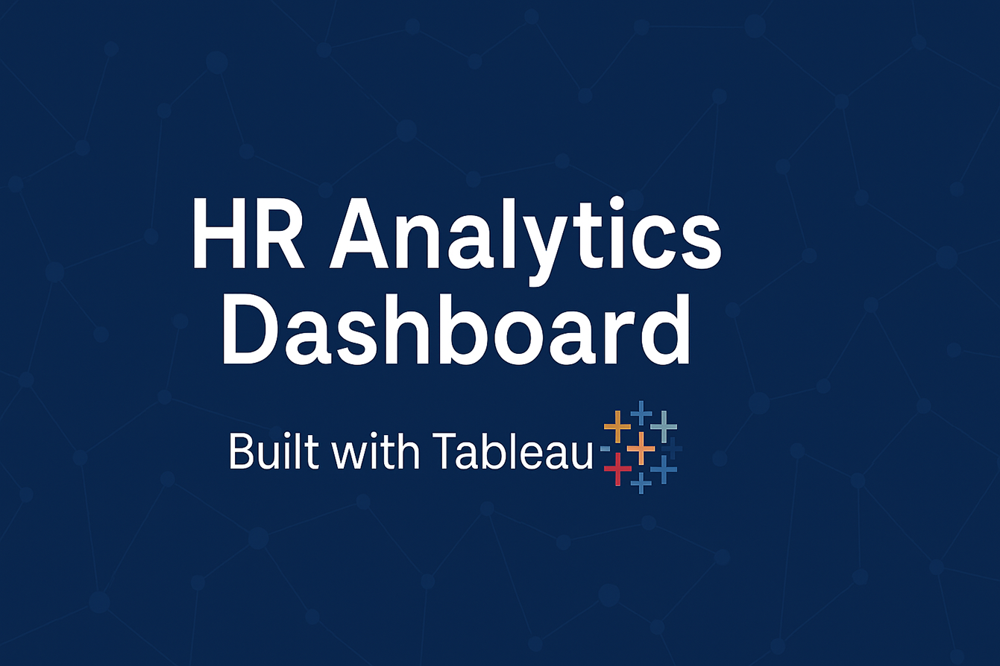
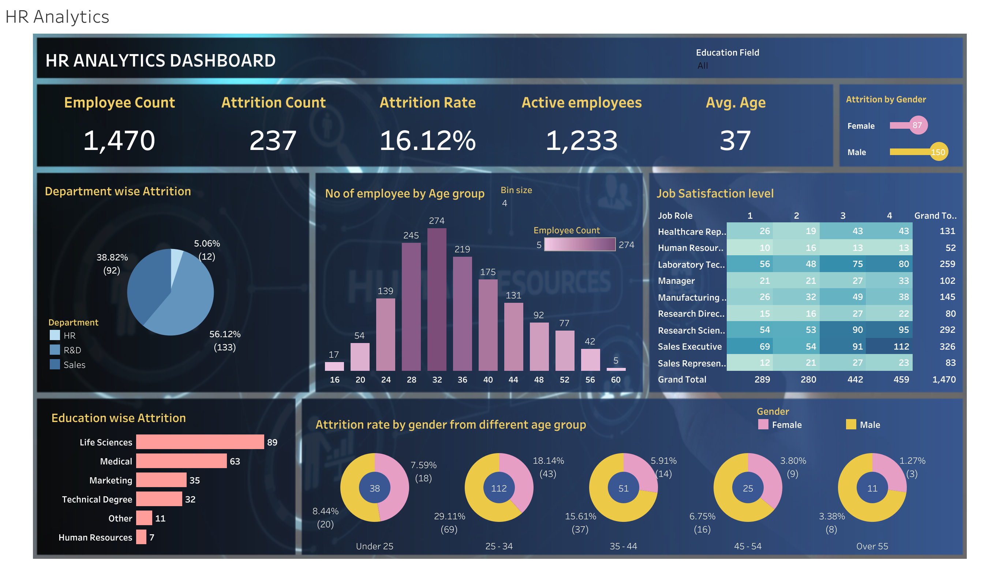

# 💼 HR Analytics Dashboard (Tableau)

## 📸 Full Dashboard Preview

---

## 📊 Project Overview
This interactive HR Analytics Dashboard is built using Tableau to analyze employee attrition, job satisfaction, age groups, and department-wise insights. It helps HR teams identify workforce trends and make data-driven decisions.

---

## 🔍 Key Insights
- **Total Employees**: 1,470  
- **Attrition Count**: 237  
- **Attrition Rate**: 16.12%  
- **Active Employees**: 1,233  
- **Average Age**: 37  
- **Department with Highest Attrition**: R&D (56.12%)  
- **Most Satisfied Role**: Research Scientist  
- **Age Group with Highest Attrition**: 25–34 (18.14%)

---

## 📌 Features
- Department-wise and education-wise attrition analysis  
- Gender-based attrition from different age groups  
- Job satisfaction level by role  
- Filters for Education Field and Gender  
- Age group distribution histogram  

---

## 🛠 Tools Used
- **Tableau Desktop** – Data visualization  
- **Excel** – Data cleaning and preparation  

---

## 📁 Files Included
- `HR_Analytics_Dashboard.twbx` – Tableau packaged workbook  
- `HR_Analytics_Dashboard.png` – Full dashboard screenshot  
- `HR_Analytic_Banner.png` – GitHub banner thumbnail  

---

## 🔗 Live Dashboard
👉 [**View Interactive Dashboard on Tableau Public**](https://public.tableau.com/app/profile/shibam.dutta/viz/HRAnalytics_17503493218940/HRAnalytics)

---

## 👤 Author

**Shibam Dutta**  
Data Analyst | Photographer | Visual Storyteller  

🔗 [**LinkedIn Profile**](https://www.linkedin.com/in/shibam-dutta-6a644a43/)

---

## 📝 How to Use
1. Clone or download the repository.  
2. Open the `.twbx` file using Tableau Desktop.  
3. Use filters in the dashboard to interact with different insights.

---

## 📌 License
This project is open-source and available for educational and portfolio use.
